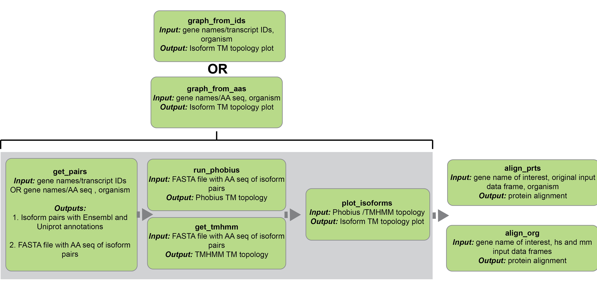
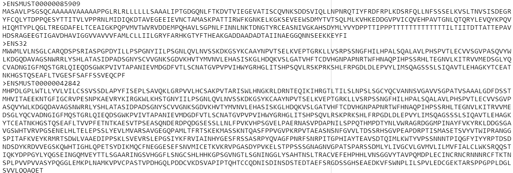
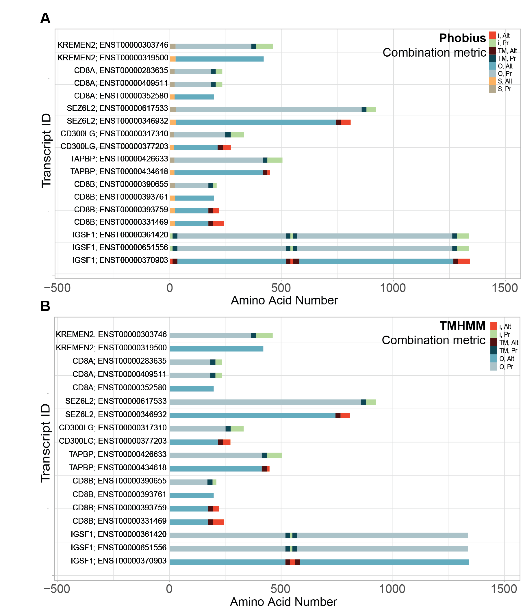
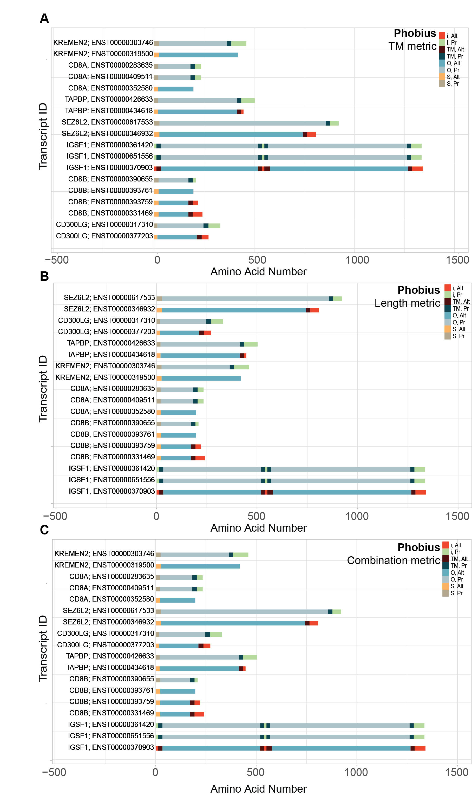
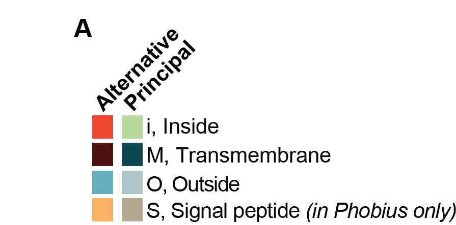
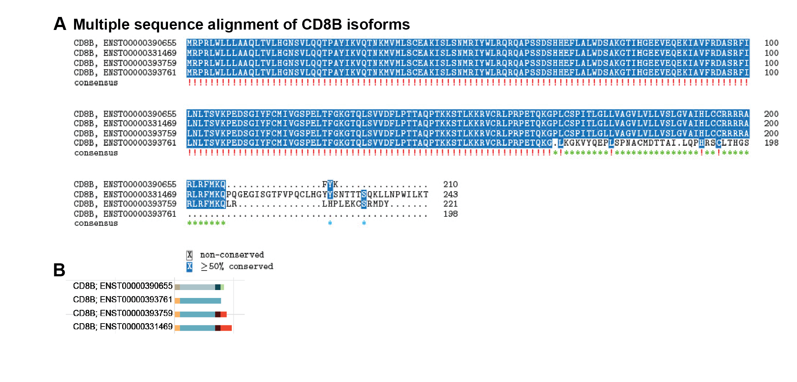

```{r, include = FALSE}
rmarkdown.html_vignette.check_title = FALSE
library(devtools)
devtools::load_all()
library(knitr)
library(kableExtra)
```

---
title: "Rapid comparison of surface protein isoform membrane topologies by SurfaltR"
author: Aditi Merchant & Pooja Gangras
output: rmarkdown::html_vignette
vignette: >
  %\VignetteIndexEntry{surfaltr_vignette}
  %\VignetteEngine{knitr::rmarkdown}
  %\VignetteEncoding{UTF-8}
---


---

## __Abstract__
Cell surface proteins are of great biomedical relevance, serving as cell type differentiators and indicators of disease states [@juliano_integrin_2011]. Consequently, proteins on the plasma membrane form a major fraction of the druggable proteome and are also used to target novel therapeutic modalities to specific cells [@juliano_integrin_2011]. Alternatively spliced surface protein isoforms have been shown to differ based on their localization within cells and their transmembrane (TM) topology [@juliano_integrin_2011; @noauthor_frontiers_nodate]. Thus, in depth analysis of cell surface protein isoforms can not only expand the diversity of the druggable proteome but also aid in differentiating delivery between closely related cell types. The transcriptomic and proteomic approaches available today make it possible to identify several novel alternatively spliced isoforms [@zhao_integrin-targeting_2020]. However, there exists a need for bioinformatic approaches to streamline batch processing of isoforms to predict and visualize their TM topologies. To address this gap, we have developed an R package, SurfaltR, which matches inputted novel or alternative isoforms to their annotated principal counterparts, rapidly predicts their TM topologies, and generates a user-friendly graphical output. Further, SurfaltR facilitates the prioritization of biologically diverse isoform pairs through the incorporation of three different ranking metrics in the graphical output and through several protein alignment functions. This vignette explains how the package can be used and demonstrates two different workflows starting from either Ensembl transcript ID’s or amino acid sequence inputs.

## __Overall Workflow of SurfaltR__
Note: If you use surfaltR in published research, please cite:
<write publication or github page>

## __Installation__ 
#### __SurfaltR Installation__
As surfaltR is hosted on Github, the devtools package is needed to successfully
install surfaltR. To install and load devtools, the following code can be used:
```{r, eval = FALSE}
install.packages("devtools")
library(devtools)
```

Once remotes is installed, surfaltR can be installed using the following code:
```{r, eval = FALSE}
devtools::install_github("EliLillyCo/surfaltR")
```

To load surfaltR, the following code can be used:
```{r, eval = FALSE}
library(surfaltr)
```

The github repository for surfaltR containing all information related to the 
package can be found at https://github.com/EliLillyCo/surfaltR.

#### __TMHMM Standalone Software Installation__
In order to be able to use TMHMM R package [@krogh_predicting_2001] within surfaltR to predict membrane topology, it is important to first ensure that you have TMHMM 2.0 standalone software installed on your computer. To do this, simply navigate to https://services.healthtech.dtu.dk/service.php?TMHMM-2.0, and follow directions for installation of standalone software. Make sure to record the path to which TMHMM 2.0 is installed, as this information will be needed in order to run TMHMM in future functions.

#### __Phobius Installation__
As run_phobius() relies on the Phobius API, a copy of the software does not need to be downloaded on the user’s device. However, in order to ensure that sequences can be adequately processed in the R development environment, the “ragp” package needs to be installed. To install this package, the following code can be used:
```{r,  message = FALSE, results = 'hide', eval=FALSE}
devtools::install_github("missuse/ragp")
```

<a id="qs"></a>

## __SurfaltR pipeline and quick start__
SurfaltR allows users to have dynamic options about which output they want to receive through the presence of consensus functions allowing for rapid processing and individual functions producing intermediate outputs. SurfaltR allows users to pair novel isoforms or condition/tissue associated alternatively/mis-spliced isoforms with their counterpart principal isoforms, as annotated by APPRIS[@rodriguez_appris_2018]. It then predicts the TM topologies of isoform pairs using either TMHMM or Phobius, as inputted by user, and generates a plot for rapid cross-isoform comparison. Finally, it allows the user to generate cross-organism and single organism multiple sequence alignments of isoform pairs through the standalone functions align_prts() and align_org_prts(). All functionalities withing surfaltR are dependent on the most recent Ensembl human and mouse annotations (GRCh38.p13 and GRCm39 respectively) . The overall workflow of surfaltR is shown in the figure below:
<center>

```{r, echo = FALSE, out.width = "85%", fig.align = "center"}

```
Figure 1: Overall surfaltR workflow and functions.

</center>
Now we describe the overall functions which will generate a plot of TM topologies for transcripts-of- interest paired with gene-matched annotated principal isoforms. To rapidly generate isoform pair plots, the functions graph_from_ids() or graph_from_aas() can be used. If you are using the graph_from_ids() function, input data should be formatted with only gene names and transcript IDs according to guidelines detailed in the [“Obtaining and Formatting Input Data Section”](#Obtaining_and_Formatting_Input_Data). If you are using the graph_from_aas() function, input data should be formatted with gene names, unique transcript identifiers, and amino acid sequences according to guidelines detailed in the [“Obtaining and Formatting Input Data Section”](#Obtaining_and_Formatting_Input_Data). Other input parameters are described in detail in the [“Rapid Plotting of Paired Isoforms”](#Rapid_Plotting_of_Paired_Isoforms) section below. 

```{r, eval=FALSE}
graph_from_aas(data_file = "~/CRB1.csv", organism = "mouse", rank = "combo", 
               n_prts = 20, mode = "phobius", size_txt = 2, space_left = -400, 
               temp = FALSE)

graph_from_ids(data_file = "~/hpa_genes.csv", organism = "human", 
               rank = "combo", n_prts = 20, mode = "phobius", size_txt = 2, 
               space_left = -400, temp = FALSE)
```

## __How to get help for surfaltR__
All questions can be posted on the [Github page](https://github.com/EliLillyCo/surfaltR) where the package is being hosted. Opening a Github issue is the fastest way to reach us.

## __Input data__
As mentioned above, surfaltR is able to process two different forms of inputs: transcript IDs and amino acid sequences. This enables surfaltR to process novel transcripts in addition to transcripts already documented on Ensembl and annotated by APPRIS. 

<a id="Obtaining_and_Formatting_Input_Data"></a>

## __Obtaining and Formatting Input Data__
Input to the surfaltR package must be formatted as a comma separated text file either 1) containing transcript ID’s and corresponding gene names or 2) containing amino acid sequences for novel isoforms with unique identifiers and corresponding gene names. For files containing only transcript IDs and gene names, column names should be titled “gene_name” and “transcript”. For files containing amino acid sequences, columns should be titled “external_gene_name”, “transcript_id”, and “protein_sequence”. The input transcripts and amino acid sequences can be derived from multiple upstream analysis procedures such as differential isoform expression analysis, long read sequencing for identification of novel isoforms, and others. 

#### __Why filter genes known to encode surface proteins?__
While surfaltR can be used to plot topology of several proteins with the limit being set by the bulk processing power of TMHMM standalone software and Phobius web server, we recommend limiting input to isoforms of genes known to encode surface proteins. This can be done by using existing protein repositories and annotation systems such as Uniprot and Surfacegenie [@waas_surfacegenie_2020] to filter out isoforms that map to genes known not to encode surface proteins. This pre-processing step will ensure optimum performance of the package.

<a id="exid"></a>

#### __Gene name and transcript ID’s input (Input type 1)__
The example input table containing data from Uhlén et al. [@uhlen_proteomics_2015] is shown 
below with column names "gene_name" and "transcript". This matches the format
required for surfaltR to be able to process ID-based input data.

```{r, echo = FALSE}
all_genome_data <- read.csv(file = "hpa_genes.csv", header = TRUE)
kable(head(all_genome_data), align = 'c')%>%
  kable_styling(full_width = T)
```

<a id="exaa"></a>

#### __Gene name and amino acid sequence input (Input type 2)__
The example input table containing data from Ray et al. [@ray_comprehensive_2020] is shown 
below with column names "external_gene_name", "transcript_id", and "protein_sequence".
This matches the format required for surfaltR to be able to process amino acid
sequence-based input data.

```{r, echo = FALSE}
all_genome_data <- read.csv(file = "CRB1.csv", header = TRUE)
all_genome_data <-  data.frame(lapply(all_genome_data, substr, 1, 70))
for(row in 1:nrow(all_genome_data)){
  all_genome_data[row, "protein_sequence"] <- paste(all_genome_data[row, "protein_sequence"], "...", sep = "")
}
kable(head(all_genome_data), align = 'c')%>%
  kable_styling(full_width = T)
```

## __About the example datasets__
The example datasets have been derived from two different sources and saved in the data/ folder within the package installation and in the data/ folder on the SurfaltR package repository on Github (link). 

1.	For the transcript ID input, we have included 10 unique transcripts from 7 different genes annotated as alternative by APPRIS. These genes were derived from supplementary data 12 from Uhlén et al. [@uhlen_proteomics_2015]. This data has been formatted to be compatible with the package as described [above](#exid).
2.	For the amino acid input, we have utilized the supplementary data 1 from Ray et al. [@ray_comprehensive_2020]. This data includes novel isoforms expressed in mouse retina identified by long read sequencing and further validated by cell surface proteomics approaches. The data has been formatted to be compatible with the package as described [above](#exaa).

<a id="Rapid_Plotting_of_Paired_Isoforms"></a>

## __Rapid Plotting of Paired Isoforms__
As mentioned in [quick start](#qs), overall functions graph_from_ids() or graph_from_aas() can be used to directly generate TM topology plots of paired isoforms from input isoform ID/AA seq .csv files. 

_Note: For a standard number of transcripts (25-50), the run time can be expected to be 1-2 minutes. If a large number of transcripts are provided (e.g. 500), the run time can be expected to be closer to 15 minutes. Occasionally, if Ensembl BioMart, TMHMM, or Phobius is down, run time can take much longer. In the event that a function has been running for more than 30 minutes, please stop the function and try again later._

<a id="txid"></a>

#### __From known Ensembl Transcript Models (Input type 1)__
When a .csv file containing known [Ensemble transcript IDs and gene names](#exid) is provided, the graph_from_ids() function can be utilized to obtain the completed plot of paired isoforms. Additionally, the function can include optional inputs summarized in the table below:

```{r, echo = FALSE}
inp <- read.csv(file = "Input_Table.csv", header = TRUE, fileEncoding="latin1")
kable(inp, align = 'c')%>%
  kable_styling(full_width = T)
```

An example of the code required to run this function applied to the Uhlén et al. [@uhlen_proteomics_2015]. data is shown below:

<a id="ti"></a>

```{r,  eval=FALSE}
graph_from_ids(data_file = "~/hpa_genes.csv", organism = "human", 
               rank = "combo", n_prts = 20, mode = "phobius", size_txt = 2, 
               space_left = -400, tmhmm_folder_name = NULL)
```

<a id="aaid"></a>

#### __From Amino Acid Sequence Input (Input type 2)__
When a .csv file containing [gene names and amino acid sequences is provided](#exaa), the graph_from_aas() function can be utilized to obtain the completed plot of paired isoforms. Additionally, the function can also include the optional inputs summarized in the table [above](#ti).

An example of the code required to run this function applied to the Ray et al. [@ray_comprehensive_2020] data is shown below:
```{r, eval=FALSE}
graph_from_aas(data_file = "~/CRB1.csv", organism = "mouse", rank = "TM", 
               n_prts = 10, mode = "tmhmm", size_txt = 2, space_left = -400, 
               tmhmm_folder_name = NULL)

```

## __Isoform Pairing of Input Data and FASTA File Generation__
If the user is taking a sequential approach instead of using the overall functions, the following functions can be used to generate intermediate output. The first function that needs to be run is the get_pairs() function, which retrieves APPRIS annotations, pairs alternative and principal isoforms together, and retrieves amino acid sequences to create a FASTA file. In order to function correctly, the input data needs to follow the format mentioned [above](#Obtaining_and_Formatting_Input_Data). The input parameters include a string containing the path to the input data file (data_file), a boolean stating if the data contains amino acids (if_aa), a string with the organism the data is derived from (organism), and a boolean stating if output files should be deleted after running (temp, recommended to always be FALSE). More details about these parameters can be found [above](#ti).  

The output of the function contains two separate components: 1) a data frame containing the paired isoforms along with APPRIS annotations and amino sequences and 2) a FASTA file containing the transcript ID followed by the amino acid sequence for each transcript. These outputs are described in more detail [below](#isoout). 
An example of the code required to run this function applied to the Ray et al. [@ray_comprehensive_2020] data is shown below:

```{r, eval = FALSE}
AA_seq <- get_pairs(data_file = "~/CRB1.csv", if_aa = TRUE, organism = "mouse", temp = FALSE)

```

<a id="isoout"></a>

##### __Output 1: Paired Isoforms__
Below is a table depicting the table output from the get_pairs function applied 
to the Ray et al. [@ray_comprehensive_2020] dataset:

```{r, echo = FALSE, eval = FALSE}
AA_seq <- get_pairs("/home/l014011/CRB1.csv", TRUE, "mouse")
AA_seq <-  data.frame(lapply(AA_seq, substr, 1, 30))
for(row in 1:nrow(AA_seq)){
  AA_seq[row, "protein_sequence"] <- paste(AA_seq[row, "protein_sequence"], "...", sep = "")
}
kable(head(AA_seq), align = 'c')%>%
  kable_styling(full_width = T)
```

##### __Output 2: FASTA File__ 
Below is a snippet of the FASTA file produced from this function when applied
to the Ray et al. [@ray_comprehensive_2020] dataset:

```{r, echo = FALSE, fig.align = "center"}

```

## __Determine TM topology__ 
Once an appropriate FASTA file is generated containing the amino acid sequences for each transcript, surfaltR can rapidly predict TM topology using the functions described below. The TM topology of surface proteins is very challenging to study by wet-lab experiments and thus several prediction algorithms described in detail in Punta et al. [@punta_membrane_2007] have been developed to predict TM topology. Using the Uniprot database as a reference [@noauthor_sam_nodate], we have chosen to include two different TM domain prediction tools in our package: TMHMM [@krogh_predicting_2001] and Phobius [@kall_combined_2004]. 

An example output plot generated from TMHMM versus Phobius applied
to the Ray et al. [@ray_comprehensive_2020] dataset is shown below:
<center>

```{r, echo = FALSE, out.width = "50%", fig.align = "center"}

```
Figure 2: Resultant Isoform Plot from TMHMM and Phobius TM Topology Prediction Algorithms for Uhlén et al. data

</center>
#### __Using TMHMM__
In order predict TM topology using TMHMM 2.0 [@krogh_predicting_2001], surfaltR includes a function called get_tmhmm(). This function uses the AA.fasta file generated as the output of the get_pairs() function and the full path to the folder containing the TMHMM 2.0 software as input (fasta_file_name). The path to TMHMM 2.0 should be provided as a string and end in "TMHMM2.0c". For the fasta file input parameter, the input should be provided as a string that just includes the file name of the fasta file to be used without a path. The function will return a data frame (output as path to/working directory/mem_topo_tmhmm.csv) with the TMHMM-predicted location for each amino acid in all the protein sequences. The topology is expressed as i- inside the plasma membrane, M- TM, o- outside the plasma membrane and O – unknown/assumed to be outside.

To run get_tmhmm alone, the following code can be used:
```{r, eval = FALSE}
mem_topo <- get_tmhmm(fasta_file_name = "AA.fasta", tmhmm_folder_name = "~/TMHMM2.0c")
```

It's important to note that in order for this function to run, there needs to 
be a FASTA file containing the amino acid sequences for each transcript within
the "output" folder in the working directory. If the get_pairs function is run 
before the get_tmhmm() function, this folder and file will be created automatically. 
The code below can be used to automate the fasta file generation and membrane
topology prediction process:
```{r, eval = FALSE}
AA_lst <- get_pairs(data_file = "~/CRB1.csv", if_aa = TRUE, organism = "mouse")
mem_topo <- get_tmhmm("AA.fasta", tmhmm_folder_name = "~/TMHMM2.0c")
```

#### __When to Use TMHMM__
If the transcripts being run are not public information or should be kept private, the TMHMM standalone software along with the tmhmm R package provides an avenue to evaluate TM topology without using an external server, making it the ideal TM prediction algorithm in this instance. However, TMHMM is not able to predict the presence of signal peptides, possibly resulting in inaccuracies in TM prediction at the beginning of the sequence. Additionally, if a protein has no TM domains, TMHMM automatically flags the protein as extracellular, which is not always true and should be either verified experimentally or verified by comparison to the prediction by Phobius.

#### __Using Phobius__
In order predict TM topology using Phobius, surfaltR includes a function called run_phobius(). This function takes in the AA.fasta file generated as the output of the get_pairs() function (fasta_file_name). Additionally, this function is reliant on the data frame returned by the get_pairs() function as an input parameter (AA_seq). The function will return a data frame (output as path to/working directory/mem_topo_phobius.csv) with the Phobius-predicted location for each amino acid in all the protein sequences. The topology is expressed as i- inside the plasma membrane, M- TM, o- outside the plasma membrane and s – signal peptide.

To run run_phobius alone, the following code can be used:
```{r, eval = FALSE}
topo <- run_phobius(AA_seq = AA_lst, fasta_file_name = "~/surfaltr/AA.fasta")
```

To automatically generate the FASTA file used by the function, the following 
code can be used:
```{r, eval = FALSE}
AA_lst <- get_pairs(data_file = "~/CRB1.csv", if_aa = TRUE, organism = "mouse")
mem_topo <- run_phobius(AA_seq = AA_lst, fasta_file_name = "~/surfaltr/AA.fasta")
```

#### __When to Use Phobius__
In terms of prediction specificity, Phobius’s ability to detect signal peptides contributes to a greater amount of detail than TMHMM. Additionally, as all sequences are run using an API as opposed to local software, the run time for Phobius is also slightly lower. However, if a protein has no TM domains and no signal peptide, Phobius automatically flags the protein as internal, which is not always true and should be verified experimentally before drawing any conclusions. If sequences are considered private information and should not be posted externally, we recommend using TMHMM to ensure everything is run locally. 

#### __Interpreting Results from Both Phobius and TMHMM__
The usage of TM predictions from both TMHMM and Phobius serves as a powerful tool
for evaluating which TM predictions are likely to be accurate biologically. 
Generally speaking, if TM domains appear in both TMHMM and Phobius predictions, 
they are likely to be witnessed experimentally as well. If certain 
domains are only seen on one of the outputs, the likelihood of the domain
actually being present is lower. However, as Phobius is able to differentiate
between signal peptides and TM domains, any TM regions 
predicted at the beginning of the sequence by Phobius are likely to be present 
regardless of TMHMM's prediction. TMHMM's TM predictions tend to be more conservative
than Phobius's. Thus, evaluating membrane topology using both methods is an effective
way to decide which TM regions are most likely to be present experimentally. 

## __Ranking and Plotting of Isoform Pairs__
To easily visualize the differences that may exist between isoform pairs, surfaltR includes options to easily filter by the most significantly different isoforms and view the differences in TM topology between isoforms. This is accomplished by a single function: plot_isoforms().It produces a TM topology plot of all paired isoforms ranked by either length, TM, or a combination metric calculated using both factors. In order to use plot_isoforms(), several inputs need to be provided. These include the data frame returned by the get_phobius() or get_tmhmm() function (AA_seq), the data_frame returned by the get_pairs() function (topo), method of ranking (rank), number of genes to be displayed (n_prts), size of text labels (size_txt), and amount of space left of the plot for transcript labels (space_left). More detail on these inputs can be found [above](#ti) and in the help page for this function.

To plot isoform pairs, the following code can be used:
```{r, eval = FALSE}
AA_lst <- get_pairs(data_file = "~/CRB1.csv", if_aa = TRUE, organism = "mouse")
mem_topo <- run_phobius(AA_seq = AA_lst, fasta_file_name = "~/AA.fasta")
plot_isoforms(topo = mem_topo, AA_seq = AA_lst, rank = "combo", n_prts = 15, 
              size_txt = 3, space_left = -400)
```

The output plot will automatically be saved as a pdf within the “output” folder within the working directory. 

#### __Ranking criteria__ 
To determine which alternatively spliced/mis-spliced isoforms are significantly different from the principal isoforms, surfaltR provides users the option to sort or rank isoform pairs by three different criteria: length, difference in number of TM domains, and a combination metric that takes both length and TM difference into account. The ranking equations are described below:

##### __Ranked by Length__
_Length Difference = |Prnc Length - Alt Length|_

When ranking by length, the differences in length that are the largest will always be ranked higher than those that are lower. Thus, as expected, isoform pairs where the alternatively/mis-spliced isoform is nearly equal in length to the principal isoform will be ranked last and displayed at the bottom of the plot. 

##### __Ranked by Number of TM Domains__
_TM Difference = Alt TM - Prnc TM_

In this situation, a positive TM difference is ranked higher than a negative or zero TM difference as this indicates that the alternative isoform has gained a TM domain and therefore may have a novel extracellular domain and/or function. For any difference below 0, isoform pairs will be ranked so that alternatively/mis-spliced transcripts that have more TM domains lost will be ranked higher than those that have lost only a few domains. To contextualize this ranking system, the following table can be used as an example:

```{r, echo = FALSE}
tm_rank <- read.csv(file = "/home/l014011/TM_Table.csv", header = TRUE, fileEncoding="latin1")
kable(tm_rank, align = 'c')%>%
  kable_styling(full_width = F)
```

##### __Ranked by Combo Metric__
_Combo Difference = ∆TM * |∆Length|_
_If ∆TM or ∆Length is 0, rank by -|∆Length|/100_

In this situation, isoforms that have a high difference in both length and number of TM domains are ranked higher than those that have very small differences. For any difference below 0, isoform pairs will be ranked so that pairs that have a more negative combo difference will be ranked higher than those that have a combo difference close to 0 as this is indicative of a larger difference between principal and alternative/mis-spliced isoforms. If the difference in TM domains or difference in length is between the isoform pairs is equal to 0, the isoforms will be ranked by their -1*difference in length/100 in order to prioritize isoforms that have both TM and length differences.  
To contextualize this ranking system, the following table can be used as an example:

```{r, echo = FALSE}
cm_rank <- read.csv(file = "/home/l014011/Combo_Table.csv", header = TRUE, fileEncoding="latin1")
kable(cm_rank, align = 'c')%>%
  kable_styling(full_width = F)
```

An example of how the different ranking systems change the appearance of the plots is shown below:
<center>

```{r, echo = FALSE, out.width = "65%", fig.align = "center"}

```
Figure 3: Comparison of Length, TM, and Combo Ranking Metrics for Uhlén et al. data

</center>

#### __Choosing and Formatting Isoform Pairs to Display__
In addition to ranking the proteins, the plot_isoforms() function can also choose how many proteins to display. Depending on the number supplied to the n_prts input parameter, the user can choose the number of top-ranked pairs to display on the plot. Generally, it is recommended to limit the number of isoform pairs displayed in the plot to under 30 as otherwise the plot can appear cluttered. However, if the user wants to view all isoforms on the same plot, they simply have to enter the total number of genes they entered into the n_prts parameter. As the number of isoform pairs displayed gets larger, the size_txt parameter should be reduced and the space_left parameter should be increased to accommodate more isoform plots. Similarly, if only a few isoforms are plotted, the size_txt parameter should be increased and the space_left parameter decreased. The following table provides helpful guidelines for size parameters that can be used for different values of n_prts:

```{r, echo = FALSE}
ft_rank <- read.csv(file = "/home/l014011/Format_Table.csv", header = TRUE, fileEncoding="latin1")
kable(ft_rank, align = 'c')%>%
  kable_styling(full_width = T)
```

#### __Plot Interpretation__
As aforementioned, the output of plot_isoforms() is a plot depicting ranked isoform pairs. Both membrane topology and APPRIS categorization are differentiated through color, as shown below:
<center>


```{r, echo = FALSE, out.width = "50%", fig.align = "center"}

```
Figure 4: Color Categorization for Membrane Topology and Principal Versus Alternative Differentiation

</center>
Although the plots provide an accurate prediction of TM topology for principal and alternative isoforms, there are a few caveats to keep in mind when interpreting the plots. Firstly, on plots created using Phobius’s model, any isoforms that have no TM region and no signal peptide will always be classified as intracellular. Due to the difficulty associated with predicting non-surface protein localization _in silico_, it is hard to tell if these isoforms are actually intracellular. Thus, these isoforms should not be regarded as intracellular but rather as unknowns. Similarly, on plots created using TMHMM’s model, any isoforms lacking TM regions will be classified as extracellular. Again, it is very difficult to tell computationally if this protein is extracellular and as such, isoforms categorized as fully extracellular should also be regarded as unknowns unless there is experimental information on isoforms from this gene being secreted. 

_Note: The isoforms pairs seen in the plots produced by surfaltR are not aligned. Therefore, the first amino acid seen in the alternative isoform of one pair may not necessarily correspond to the first amino acid in the principal isoform. In order to facilitate sequence alignment, surfaltR also includes [functions](#MSA) that perform multiple sequence alignment of isoform pairs. When used in combination, this can help with the interpretation of isoform pair plots._

<a id="MSA"></a>

## __Multiple Sequence Alignment for Genes of Interest__
To enable users to take a closer look at genes of interest from the isoform pair plot, surfaltR also offers users the ability to align amino acid sequences from isoform pairs to easily visualize differences in sequences that may contribute to differences in topology. This functionality can be applied for isoform pairs of interest from a single organism through the function align_prts(). If the user wants to align isoform pairs from multiple organisms, surfaltR also offers a function to facilitate this through align_org_prts() given that the paralog from the other organism was provided as input.

#### __From Isoform Pairs from a Single Organism__
After identifying genes of interest from an isoform pairs plot, surfaltR offers users an easy way to align amino acid sequences from the same gene through the align_prts() function. Input variables include a vector containing
the genes of interest (gene_names), a string containing the path to the file containing the data to be used (data_fie), a boolean stating if the data cotnains amino acids (if_aa), and a string stating which organism the data is from (organism).

The code used to run the align_prts function is shown below:
```{r, eval = FALSE}
align_prts(gene_names = c("Crb1", "Adgrl1"), data_file = "~/CRB1.csv", 
           if_aa = TRUE, organism = "mouse")
```

This function will produce PDF files containing the aligned sequences and FASTA files containing the sequences and transcript IDs for each gene, which will be saved to the working directory. 

#### __From Isoform Pairs from Multiple Organisms__
In addition to single organism alignment, surfaltR also provides users an easy way to align amino acid sequences from the same gene from multiple organisms through the align_org_prts() function. To use align_prts(), the user needs to provide the names of the genes they are interested in examining from both organisms (gene_names), the path to the file cotnaining the human data (hs_data_file), the path to the file containing the mouse data (ms_data_file), and a boolean stating if the data contains amino acid sequences (if_aa).

The code used to run the align_org_prts function is shown below:
```{r, eval = FALSE}
align_org_prts(gene_names = c("IGSF1", "TAPBP"), hs_data_file = "~/hpa_genes.csv", 
               mm_data_file =  "~/hpa_mouse_genes.csv", if_aa = FALSE)
```

This function will produce PDF files containing the aligned sequences and FASTA files containing the sequences and transcript IDs for each gene, which will be saved to the working directory. 

#### __Interpreting Alignment Results and Isoform Pair Plots__ 
When used in combination, alignment results and isoform pair plots provide a powerful way to fully understand differences that may exist between principal and alternatively/mis-spliced isoforms. The membrane topology bar plots can be compared to the protein alignment to identify changes in sequence contributing to the changes in topology. An example of this analysis is shown below.
<center>


```{r, echo = FALSE, fig.align = "center"}

```
Figure 5: Multiple Sequence Alignment of CD8B Isoforms Compared to Isoforms Plot Output

</center>
## __Checking surfaltR Installation and Functionality__
In order to validate the functionality of surfaltR, we have included the test_surfaltr function. This function has no input parameters, and can be called using the code below:
```{r, eval = FALSE}
test_surfaltr()
```

If surfaltR is installed correctly, the function should print a message stating "The test was successful. SurfaltR works as expected!". If not, the function will print errors explaining what may be incorrect. This includes stating if any dependencies have not been installed, if surfaltR’s installation failed, if THMHMM is installed incorrectly, or if the working directory cannot be written to. 

## __References__


```{r, include = FALSE}
knitr::opts_chunk$set(
  collapse = TRUE,
  comment = "#>"
)
```

```{r setup, include = FALSE}
library(surfaltr)
```
